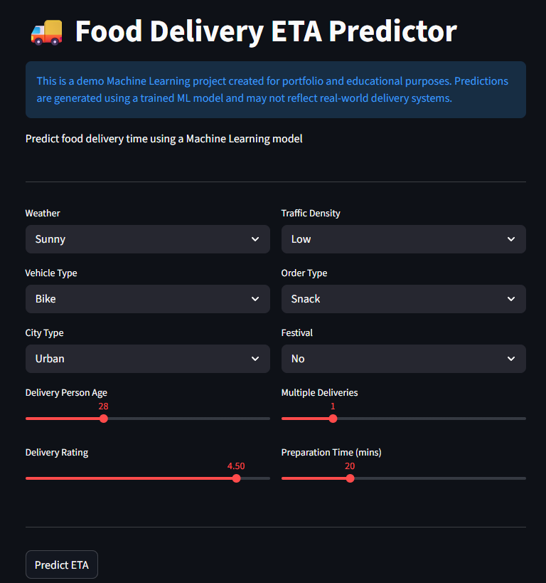
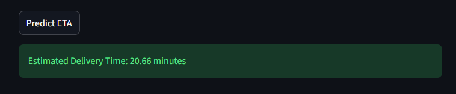
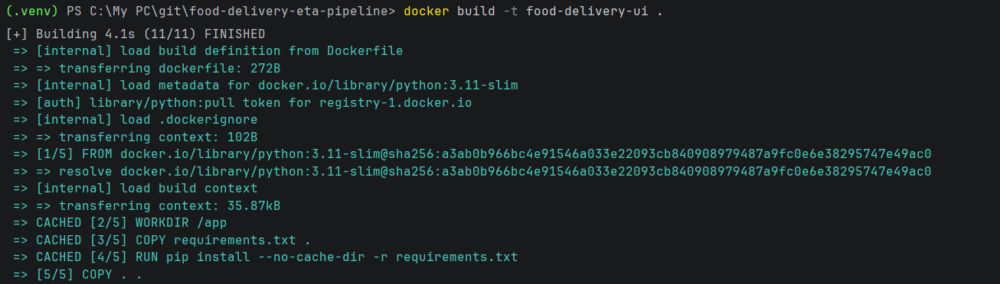
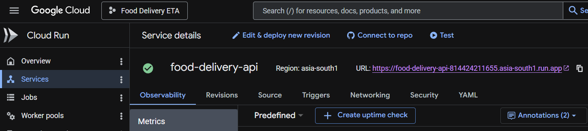

# Food Delivery ETA Prediction System

End-to-end ML app that predicts delivery time (minutes) from order metadata, weather, traffic, courier info, and coordinates. Trained several regressors, shipped **CatBoost** to production, and deployed a **Streamlit** UI on **Google Cloud Run** via **Docker**.

**Live demo:** [Link to the demo app](https://food-delivery-api-814424211655.asia-south1.run.app)

---

> **Demo notice** — Portfolio project for learning and interviews. Not connected to any real delivery platform. Predictions are model outputs on historical-style data, not operational SLAs.

---

## Screenshots

**Streamlit UI**



**Prediction output**



**Architecture**


**Docker build**



**GCP deployment**



---

## Architecture

```text
User → Streamlit UI → preprocessing + CatBoost → ETA (minutes)
```

Inference reuses the same feature engineering as training: engineered fields are built, raw datetime columns are dropped, and the model receives a fixed 20-column schema with categoricals handled natively by CatBoost.

---

## Tech stack

| | |
|---|---|
| **ML** | Python, Pandas, Scikit-learn, CatBoost, XGBoost, LightGBM |
| **App** | Streamlit |
| **Serving** | Docker, Google Cloud Run |
| **Optional API** | FastAPI (`src/main.py`) |

---

## ML workflow

1. **Data** — Food delivery records (agent, weather, traffic, coords, order times, target `Time_taken(min)`).
2. **Cleaning** — Missing values, type fixes, drop leaky/ID columns.
3. **Features** — `distance_km`, `order_hour`, `day_of_week`, `is_weekend`, `meal_time`, `preparation_time`; drop `Order_Date`, `Time_Orderd`, `Time_Order_picked` before modeling.
4. **Training** — 80/20 split; compare linear + tree/boosting models in `notebooks/01_data_exploration.ipynb`.
5. **Selection** — CatBoost for best test R² and simpler categorical inference.
6. **Inference** — `src/preprocessing.py` → `src/predict.py` → `models/catboost_model.cbm`.
7. **Deploy** — Docker image → Cloud Run (port 8080).

---

## Models

Hold-out test set (`random_state=42`).

| Model | R² |
|-------|-----|
| Linear Regression | 0.60 |
| Random Forest | 0.82 |
| XGBoost | 0.82 |
| LightGBM | 0.83 |
| **CatBoost (production)** | **0.84** |

CatBoost won on accuracy and deployment fit: no one-hot matrix at inference, fast enough predictions, compact `.cbm` artifact.

---

## Deployment

- **Image:** `Dockerfile` — Python 3.11, `requirements.txt`, Streamlit on `0.0.0.0:8080`
- **Platform:** Google Cloud Run (managed, HTTPS, scale-to-zero friendly for a demo)
- **Entrypoint:** `streamlit run app.py`

```bash
# Build & run locally
docker build -t food-delivery-eta .
docker run -p 8080:8080 food-delivery-eta

# Cloud Run (after pushing to Artifact Registry)
gcloud run deploy food-delivery-eta \
  --image <your-image> \
  --region <region> \
  --allow-unauthenticated \
  --port 8080
```

Replace the live demo link at the top once the service URL is set.

---

## Local setup

```bash
git clone https://github.com/<username>/food-delivery-eta-pipeline.git
cd food-delivery-eta-pipeline
python -m venv .venv && source .venv/bin/activate   # Windows: .venv\Scripts\activate
pip install -r requirements.txt
```

**Streamlit**

```bash
streamlit run app.py
```

**Python inference**

```python
import pandas as pd
from src.predict import predict_eta

df = pd.DataFrame([{ ... }])  # see app.py for required fields
print(predict_eta(df))
```

Requires `models/catboost_model.cbm` (from training notebook or your saved artifact).

---

## Project structure

```text
├── app.py                 # Streamlit UI
├── Dockerfile
├── requirements.txt
├── assets/screenshots/    # README images
├── models/
│   └── catboost_model.cbm
├── notebooks/
│   └── 01_data_exploration.ipynb
└── src/
    ├── preprocessing.py   # Feature engineering + schema
    ├── predict.py         # Load model, predict
    └── main.py            # Optional FastAPI
```

---

## Engineering notes

- **Train/serve parity** — Same engineered features and column order at inference; mismatches silently kill production quality.
- **Datetime as features only** — Order date/time columns are inputs to feature builders, not model inputs.
- **CatBoost for high-cardinality categoricals** — Weather, traffic, city, meal bucket without exploding the feature space.
- **Monolith demo, modular code** — UI is thin; logic lives in `src/` so the same path works in notebooks, CLI, and containers.

---

## Possible next steps

- Experiment tracking (MLflow) and a small CI deploy pipeline  
- Map-based lat/long inputs in the UI instead of fixed demo coordinates  
- Basic monitoring on Cloud Run (latency, errors, input sanity checks)

---

## License

[LICENSE](LICENSE)
